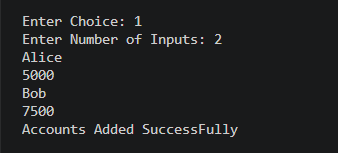
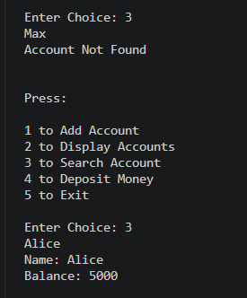

🏦 Bank Management System (C++)

A menu-driven Bank Management System built in C++ to practice Object-Oriented Programming (OOP) and the Standard Template Library (STL). This project allows users to create and manage multiple bank accounts through a simple command-line interface.

---

🚀 Features

- ➕ Add new bank accounts
- 📋 Display all accounts
- 🔍 Search for an account by name
- 💰 Deposit money into an existing account
- 📂 Store multiple accounts using "std::vector"
- 🎯 Menu-driven interface

---

🛠️ Concepts Used

- Object-Oriented Programming (OOP)
- Classes and Objects
- Constructors
- Encapsulation
- Operator Overloading ("operator+=")
- "std::vector"
- Functions
- Input Validation
- Multi-file Project Structure (".hpp" and ".cpp")

---

📁 Project Structure

bank-management-system-cpp/
│── main.cpp
│── BankAccount.hpp
│── BankAccount.cpp
│── README.md
│── LICENSE
│── .gitignore
└── screenshots/

---

▶️ How to Run

1. Clone the repository.

2. Compile the project:

g++ main.cpp BankAccount.cpp -o BankManagementSystem

3. Run the executable:

./BankManagementSystem

«On Windows:»

BankManagementSystem.exe

---

## 📸 Screenshots

### Main Menu

The main menu provides options to add accounts, display all accounts, search for an account, deposit money, or exit the application.

---

### Add Account

Create one or more bank accounts by entering the account holder's name and the initial balance.

---

### Search Account

Search for an existing account by entering the account holder's name. If the account exists, its details are displayed.

---

### Account Not Found

If the entered account name does not exist, the application informs the user with an appropriate message.

---

🎯 Learning Outcomes

Through this project, I learned how to:

- Design classes to represent real-world entities.
- Store and manage multiple objects using "std::vector".
- Search and update objects efficiently.
- Overload operators to improve class usability.
- Organize a C++ project into multiple source and header files.
- Build a complete menu-driven application.

---

🔮 Future Improvements

- Withdraw Money
- Delete Account
- Unique Account Number
- Transfer Money Between Accounts
- Save Data to Files
- Better Input Validation
- Account Transaction History

---

👨‍💻 Author

Built by Aryan as part of a continuous C++ learning journey focused on mastering programming fundamentals, Object-Oriented Programming, and the Standard Template Library (STL).
